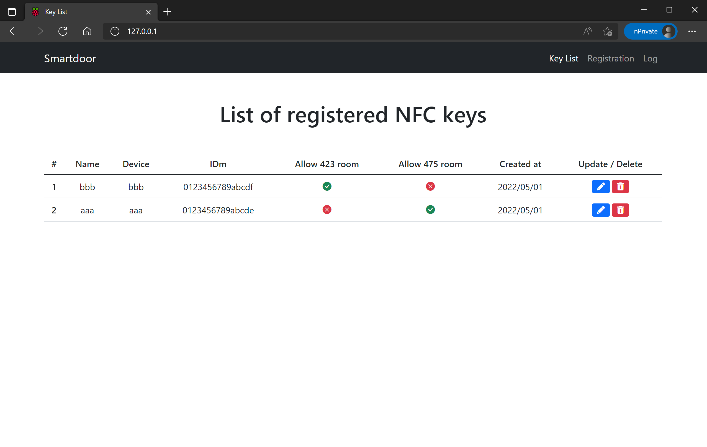
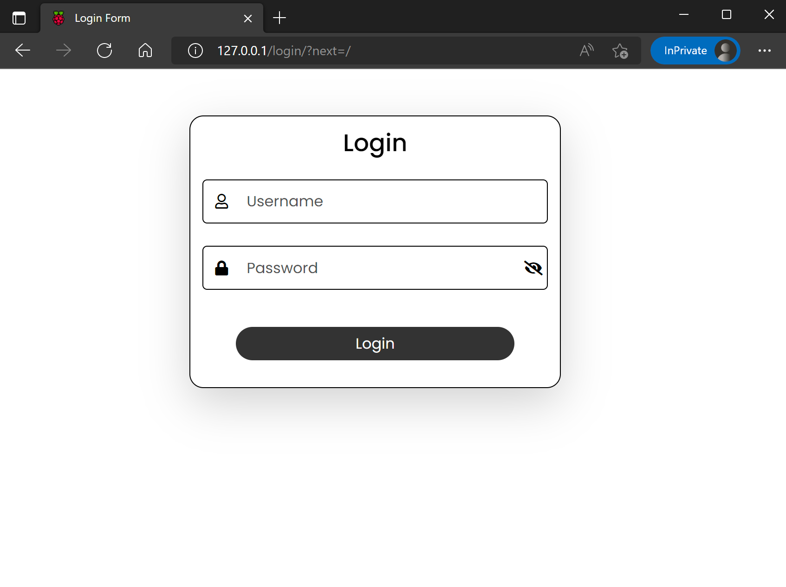
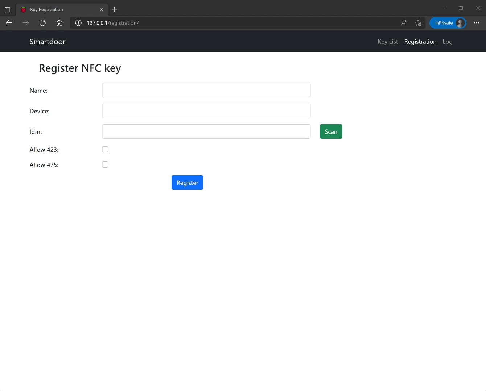

# Smartdoor Host Web Application

A Django web application to manage NFC keys for smartdoor cliant.


*Caption: This website Homepage, where the administrator can see and manage the list of user's keys.*


This repository includes `Dockerfile` and `docker-compose.yaml` files so that you can easily setup web application in a docker container.
However, before open the web homepage, it required to set the following configurations.


## 1. Set environmental values

Before starting the docker containers, you need to write the environmental values in `.env` file. The following script is the example to write in `.env` file.
```bash
# === PostgreSQL ==========================================
POSTGRES_USER=postgres
POSTGRES_PASSWORD=postgres


# === Django app ==========================================
# Database process name
DATABASE=postgres

# database connection settings
DB_ENGINE=django.db.backends.postgresql
DB_NAME=postgres
DB_USER=postgres
DB_PASSWORD=postgres
DB_HOST=db
DB_PORT=5432

# basic settings
ALLOWED_HOSTS=127.0.0.1,localhost

DJANGO_SECRET_KEY=XXX

CSRF_TRUSTED_ORIGINS=http://127.0.0.1,http://localhost
```
`CSRF_TRUSTED_ORIGINS` must contain the host server's address.

The `.env` file must be put in the same directory as `Dockerfile` is put there.


## 2. Create Login User

After starting up the container with the following command for the first time:

```bash
docker compose up -d
```
you will need to set the login username and password.

In this case, attach the running docker container:
```shell
docker exec -it gunicorn-django bash
```
and excute the creating superuser command:
```bash
python manage.py createsuperuser
```
Please refer to [how to create admin user](https://docs.djangoproject.com/en/4.0/intro/tutorial02/#creating-an-admin-user).

After setting username and password, you can access the login page (http://localhost/login/) and input .


*Caption: Login page*

## 3. Register NFC Key
---
When registering the NFC keys in this system, access the registration page by pushing the Registration button on the upper navigation bar, and fill in the form. The IDm information which is associated with each NFC device can manually input by keyboard or scanning the NFC tag by a NFC reader.


*Caption: Demonstration of the NFC key registration.*

The NFC  system of the IDm associating with NFC tag is based on [SDK for NFC Web client](https://www.sony.co.jp/Products/felica/business/products/sdk/ICS-DCWC1.html) which offered by Sony. Please check out the requirements for using this SDK like recommended NFC readers.


## Quick launch development server

You can lauch the local server which Django offers.
Moving into the `smartdoor_prj` directory, and excute the following command:
```bash
python manage.py runserver --settings=smartdoor_prj.settings_dev
```
Then, the webpage will be available by accessing the http://localhost:8000.

`settings_dev.py` is a setting file written about Django configurations for development.


## WebAPI authentication for Smartdoor client

In order for smartdoor client to use the registration informantion to authenticate an IDm, this web sever offers the WebAPI mode.
Access the this smartdoor host address adding the "authenticate" endpoint (like http://\<host ip address\>/authenticate/),
and send the IDm information using html POST method with json format:
```json
{"idm": "xxxaaayyyzzz"}
```

Before sending the above json data, it is required to obtain the CSRF token with html GET methd and apply it to the POST html header.

If the IDm is authenticated, the following json data responsed:
```json
{
    "auth": "valid",
    "name": "Name",
    "allow_423": true,
    "allow_475": false,
}
```

if not authenticated,
```json
{
    "auth": "invalid",
}
```
